# PACT Diagrams

This document collects visual representations of PACT concepts.  
Each diagram is referenced by the relevant spec chapter.

---

## 1. Context Tree Layout

---

## 2. Message Turn Pattern


---
## 3. Lifecycle Flow

```mermaid
sequenceDiagram
  participant Cycle
  participant TTL
  participant Prune
  participant Seal
  participant Snapshot

  Cycle->>TTL: expire nodes
  TTL->>Prune: enforce budgets
  Prune->>Seal: move ^ah → ^seq
  Seal->>Snapshot: commit stable tree

```

---

## 4. Selector Traversal

---

### How to reference in spec
Instead of embedding Mermaid in every spec file, you can link to the relevant section of `docs/diagrams.md`. For example:  

```markdown
See [Diagrams: Message Turn Pattern](../docs/diagrams.md#2-message-turn-pattern).
```
